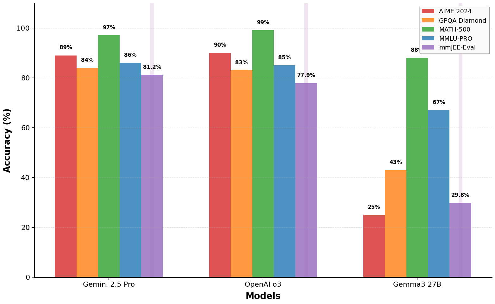
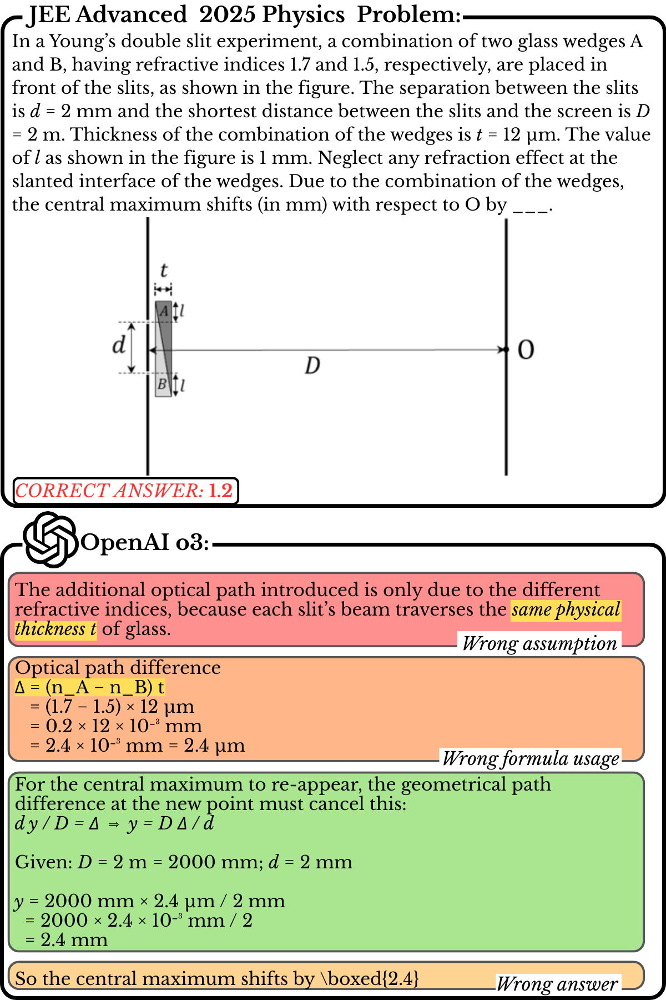

# mmJEE-Eval: A Multilingual Multimodal Benchmark for Evaluating Scientific Reasoning in Vision-Language Models

  
  
<em>Performance comparison of state-of-the-art models across mmJEE-Eval and established benchmarks: AIME 2024, GPQA Diamond, MATH-500, MMLU-PRO. mmJEE-Eval ranks as the #1 most difficult benchmark (by average score).</em>

- mmJEE-Eval  is a multimodal and multilingual dataset for LLM evaluation comprising 1,460 challenging questions from seven years (2019-2025) of India's JEE Advanced competitive examination.
- Comprehensive evaluation of five state-of-the-art VLMs reveals that even frontier models struggle significantly: Gemini 2.5 Pro achieves 81.2% accuracy while OpenAI o3 reaches 77.9%, with smaller models performing substantially worse (≤30%).
- mmJEE-Eval is significantly more challenging than the text-only JEEBench, the only other well-established dataset on JEE Advanced problems, with performance drops of 18-56% across all models.
- Our findings and manual error analysis demonstrate that contemporary VLMs remain limited in authentic scientific reasoning despite strong computational capabilities, establishing mmJEE-Eval~as a challenging benchmark that effectively discriminates between model capabilities.

  
  
<em>Example problem and response from mmJEE-Eval. Despite mathematical correctness, the model incorrectly assumes uniform thickness ("same physical thickness $t$ of glass") when the figure clearly shows wedge-shaped glass pieces with varying thickness. This multimodal reasoning failure demonstrates the multiple dimensions our proposed benchmark tests.</em>

# How to Navigate This Repository

This repository accompanies our paper submission to ARR July 2025. The codebase is organized into several key directories, each serving a specific purpose in our evaluation pipeline.

## Repository Structure

### 📁 `eval/`
Contains evaluation scripts organized by test type:

- **`eval_test_1_acc/`** - Accuracy evaluation scripts and results
  - `acc_test.ipynb` - Tests with accuracy (Section 4.1)

- **`eval_test_2_vs_jeeb/`** - JEEBench comparative evaluation
  - `jeebench.ipynb` - Gemma 3 27B evaluation
  - `jeebench_internlm3.ipynb` - InternLM3 model evaluation
  - `jeebench_qwen2.5vl.ipynb` - Qwen2.5VL model evaluation

- **`eval_test_3/`** - Manually testing examples from model outputs
  - `eval_test_3.ipynb` - Processing wrong responses
  - `manual_testing.py` - Manual testing utility

### 📁 `fig/`
Contains all visualizations and figures used in the paper

### 📁 `tools/`
Utility scripts and tools for data processing:
- `image_req_tool.py` - Pre-processing utility
- `jee_adv_answer_annotation_tool.py` - Answer annotation tool for JEE Advanced questions
- `jee_adv_ques_annotation_tool.py` - Question annotation tool for JEE Advanced problems
- `ocr.ipynb` - Example questions from our dataset after processing through an OCR agent
